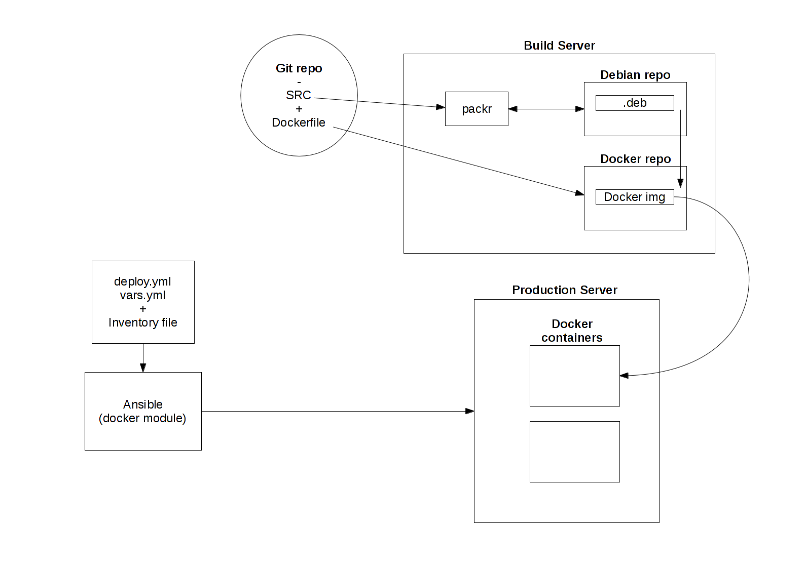

## Welcome to docker-packr!!

The aim is to reproduce the following stack:

# Packing Django projects with python-packr

Refer to [this repo](https://github.com/Cahersan/python-packr) to learn about python-packr

# Setting up a debian repo with reprepro

Generate GPG key with the following command

    $ gpg --gen-key

Follow this to export and import the keys, in case there is not enough entropy:

<http://www.debuntu.org/how-to-importexport-gpg-key-pair/>

Here is how to set reprepro to work with nginx. Check both links:

<http://davehall.com.au/blog/dave/2010/02/06/howto-setup-private-package-repository-reprepro-nginx>
<http://blog.jonliv.es/2011/04/26/creating-your-own-signed-apt-repository-and-debian-packages/>

To avoid reprepro asking for the passphrase, install GNUpG agent:

    sudo apt-get install gnupg-agent

<https://wiki.archlinux.org/index.php/GnuPG#gpg-agent>
<https://help.ubuntu.com/community/GnuPrivacyGuardHowto>

NOTE: If the server is local:

    deb http://localhost:port/ubuntu/ karmic main

or make some mapping in /etc/hosts

To fetch the packages, the key must be added using the following

    $ sudo apt-key add <path to public key>

Some other reads:

<https://wiki.debian.org/SettingUpSignedAptRepositoryWithReprepro>

### our case

To add the repo key

    wget -O - http://apt.submit.to/apt.submit.to.gpg.key | sudo apt-key add -

# Building a Docker image and running a container from it with ssh access

docker containers need to share an ssh key with the host in order to be able
to deploy apps with ansible. On the host, the following should be run: 

    $ ssh-keygen
    $ cp <home>/.ssh/id_rsa.pub .

Now the docker image can be built and run successfully

    $ sudo docker build -t <repo>:<tag> .
    $ sudo docker run -t -d -P --name <container> <image>

Run to get the ssh host port mapped to port 22 in the container

    $ sudo docker port <container_name> 22 

ifconfig helps you find the local IP address for docker daemon

Now you could access the container via ssh like this

    $ ssh root@<docker_daemon_IPPADDR> -p <port>   

*Snippets to stop / remove all docker containers*

    $ sudo docker stop $(sudo docker ps -a -q)
    $ sudo docker rm $(sudo docker ps -a -q)

**Provisioning a running container with ansible**

The address:port pair must be indicated in /etc/ansible/hosts

    $ app ansible_ssh_host=<ssh_host> ansible_ssh_port=<ssh_port>  

Now a ping can be sent with ansible to the container. 

    $ ansible all -m ping --ask-pass -u root

# Setting up a private Docker registry 

    $ sudo docker pull samalba/docker-registry
    $ sudo docker run -d -p 5000 samalba/docker-registry

Check port where the container is running to name the images accordingly. e.g.:

*port is 49155. To send an image to private registry tag it as:*

    $ sudo docker tag <image> <url(localhost):port>/name[:tag]

To password protect the registry use the [nginx auth module](http://nginx.org/en/docs/http/ngx_http_auth_basic_module.html)

htpasswd files can be generated using [this cool webapp](http://aspirine.org/htpasswd_en.html)

I set a upstart script in /etc/init too. Start it with 
    $ start docker-registry

# Build and Production servers

* "Build server" logic
    - Detect new project version in GIT repo. Pull it.
    - Build adequately version-tagged .deb package with packr.
    - Build adequately version-tagged docker image.

* App deployment in "Production server"
    - Made with ansible (ansible docker module).
    - Pulls desired docker image from private docker registry in build server.
    - Starts a parameterized container. Environment variables are set.
    - Changes nginx conf to point to new app version.

### chanages
Added to /etc/hosts
- apt.submit.to
- dockreg.submit.to

### ToDo

- Install python-packr in build server
- Set signed protected debian repo 
- Set private registry in build server
